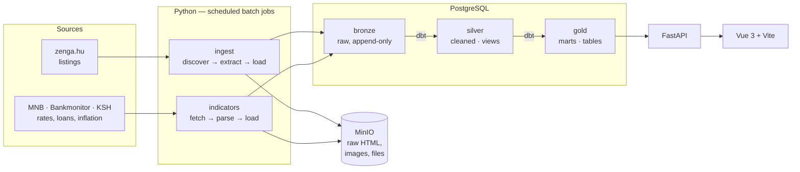

# ingatlanmizu

A data pipeline that builds a **longitudinal record of the Hungarian property market**.

Most property sites tell you what the market looks like today. This one records what it looked like on every day it has been running — every price change, on every listing, with the raw HTML that proves it. Listings are crawled from [zenga.hu](https://www.zenga.hu) every six hours and combined with central bank rates, mortgage offers, and inflation to answer the question a price per square metre cannot answer on its own: *is this getting more or less affordable?*

Built with Python 3.12, PostgreSQL, dbt, and MinIO.

📚 **[Full technical documentation →](docs/)**

---

## Architecture



Raw pages are written to object storage **before** anything parses them, so a parser bug is fixed by re-parsing rather than re-crawling. Listings are stored as an **append-only version log** with SHA-256 change detection, so price history is never overwritten. Monthly aggregates use a **point-in-time join**, so March's median stays March's median instead of silently rewriting itself on every ingest.

The [documentation](docs/) explains why each of those is the way it is — and [what is still wrong with it](docs/08-limitations.md).

## Documentation

| | Document | |
|---|---|---|
| 01 | [Architecture](docs/01-architecture.md) | Medallion layering, container topology, technology trade-offs |
| 02 | [Ingestion](docs/02-ingestion.md) | The crawler: stages, work queue, concurrency, storage, parsing |
| 03 | [Change detection](docs/03-change-detection.md) | Append-only versioning and payload hashing |
| 04 | [Market indicators](docs/04-indicators.md) | Three sources, three idempotency strategies |
| 05 | [Transformations](docs/05-transformations.md) | dbt models, cleaning macros, point-in-time joins |
| 06 | [Data quality](docs/06-data-quality.md) | Filters, grain assertions, value bounds, freshness |
| 07 | [Operations](docs/07-operations.md) | Scheduling, migrations, config, deployment |
| 08 | [Limitations](docs/08-limitations.md) | Known defects and roadmap, in detail |

## Stack

| Layer | Choice | Why |
|---|---|---|
| Ingestion | Python 3.12, `requests`, `BeautifulSoup`, `ThreadPoolExecutor` | I/O-bound crawl; threads reach the needed throughput without an async rewrite |
| Object storage | MinIO (S3-compatible) | Raw artifacts. `boto3` code moves to AWS S3 by changing an env var |
| Warehouse | PostgreSQL 18 | Medallion layers as schemas. Built-in `percentile_cont` for medians |
| Transformation | dbt (`dbt-postgres`) | A tested, documented dependency graph over SQL |
| Scheduling | Ofelia | Docker-label cron. Three jobs on one host do not need Airflow |
| API | FastAPI + `psycopg` pool | Reads `gold` only |
| Frontend | Vue 3 + Vite, Chart.js, behind Caddy | Automatic TLS from Caddy |
| Packaging | uv workspace, 4 packages | Module boundaries enforced by the build, not by convention |

## Quickstart

Requires Docker and Docker Compose.

```bash
cp .env.example .env
```

> **Heads up:** `.env.example` currently covers only the database, logging, and S3 settings. `docker-compose.yml` also needs `APP_PORT_HTTP`, `APP_PORT_HTTPS`, `SITE_ADDRESS`, `POSTGRES_PORT`, `MINIO_ROOT_USER`, `MINIO_ROOT_PASSWORD`, `MINIO_BACKEND_PORT`, `MINIO_FRONTEND_PORT`, the three `*_SCHEDULE` values, and the `SMTP_*` / `ALERT_EMAIL_*` alerting settings. Add those before starting. Filling out `.env.example` is on the [roadmap](docs/08-limitations.md).

```bash
make up
```

That starts Postgres, MinIO, the API, the frontend, the Caddy proxy, and the scheduler. Migrations apply automatically on startup.

To drive the pipeline by hand, from `api/`:

```bash
make runingest       # one crawl: discover, extract, load
make runindicators   # MNB base rates, Bankmonitor offers, KSH inflation
make dbt-build       # rebuild silver and gold, running all data tests
make dbt-docs        # browse the model DAG, column docs, and tests
```

`make dbt-docs` is the fastest way to get oriented in the transformation layer.

## Schedule

| Job | Cadence | Command |
|---|---|---|
| Ingest listings | every 6 hours | `make runingest` |
| Ingest indicators | nightly | `make runindicators` |
| Transform | nightly | `make dbt-build` |

Ofelia emails on failure only. See [Operations](docs/07-operations.md).

## Layout

```
api/
  packages/
    core/          config, database connections, migration runner
    ingest/        zenga.hu crawler — stages, tracking, storage, sources/
    indicators/    MNB, Bankmonitor, KSH
    api/           FastAPI read layer over gold
  db/migrations/   23 hand-written SQL migrations
  transform/       dbt project — staging, intermediate, marts, macros, tests
frontend/          Vue 3 + Vite SPA, Chart.js
deploy/            Caddyfile, deploy script, DB init
docs/              technical documentation
```

## Status

Single-author portfolio project, running in production against live data. The pipeline works end to end; the [limitations document](docs/08-limitations.md) is a candid account of the twelve things known to be wrong or missing, including two active bugs, each with its fix.
