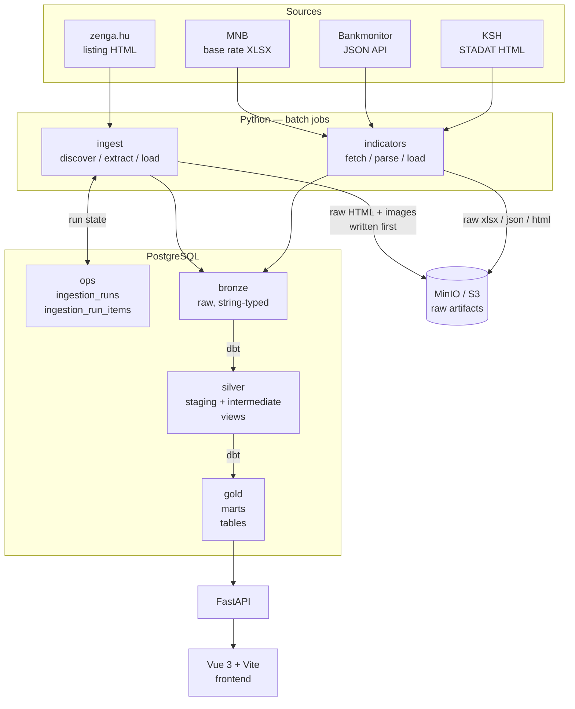

# Architecture

[← Docs index](README.md) · [Next: Ingestion →](02-ingestion.md)

---

## What this system does

`ingatlanmizu` collects Hungarian real-estate listings and the macro-financial context they sit in, turns them into a queryable warehouse, and serves aggregated market statistics over an HTTP API.

The interesting part is not any single component. It is that the system is **longitudinal**: it does not store what the market looks like, it stores what the market looked like on every day it has been running. A listing that was advertised at 50M HUF in March and 45M HUF in May exists as two rows, not one overwritten row, and the March number stays a March number forever. Almost every design decision in this repository follows from that one requirement.

## The four sources

| Source | What it provides | Acquisition | Cadence |
|---|---|---|---|
| [zenga.hu](https://www.zenga.hu) | Property listings — price, area, location, condition, type | HTML crawl | every 6h |
| MNB (Hungarian National Bank) | Central bank base rate history | XLSX file over HTTP | nightly |
| Bankmonitor | Mortgage offers from 10 Hungarian banks | Undocumented JSON API | nightly |
| KSH (Hungarian Central Statistical Office) | Consumer price index / inflation | STADAT HTML table | nightly |

The listings are the product. The other three exist because a price per square metre means nothing on its own — the question a reader actually has is *"can I afford this, and is it getting easier or harder?"*, which needs interest rates and inflation alongside the prices.

Listings are handled by the `ingest` package; the other three by `indicators`. They are separate packages because they have almost nothing in common operationally: one is a fault-tolerant crawl over hundreds of pages with per-item failure isolation, the other is three short deterministic fetch-parse-load jobs. Details in [Ingestion](02-ingestion.md) and [Market indicators](04-indicators.md).

## Layering: medallion, in one Postgres

The warehouse follows the bronze/silver/gold convention, implemented as Postgres schemas rather than as separate systems. From [`001_create_schemas.sql`](../api/db/migrations/001_create_schemas.sql):

```sql
CREATE SCHEMA IF NOT EXISTS bronze;
CREATE SCHEMA IF NOT EXISTS silver;
CREATE SCHEMA IF NOT EXISTS gold;
CREATE SCHEMA IF NOT EXISTS ops;
```

| Schema | Contents | Written by | Contract |
|---|---|---|---|
| `bronze` | Landing zone. Listing versions, observations, base rates, loans, inflation | Python (`ingest`, `indicators`) | Faithful to the source. Values land as **strings**; nothing is coerced, corrected, or dropped |
| `silver` | Staging + intermediate models, materialized as **views** | dbt | Cleaned, typed, filtered, renamed to English. One row per business event |
| `gold` | Marts, materialized as **tables** | dbt | Aggregated and consumer-shaped. The API reads only from here |
| `ops` | Pipeline metadata — ingestion runs, run items, applied migrations | Python | Not analytics. This is the pipeline's own telemetry |

The next migration, [`002_drop_public.sql`](../api/db/migrations/002_drop_public.sql), is a single line:

```sql
DROP SCHEMA IF EXISTS public;
```

That is deliberate. With `public` gone, every table has to declare which layer it belongs to. There is no default schema to accumulate whatever nobody thought about, and an unqualified `CREATE TABLE` fails instead of silently succeeding in the wrong place.

`ops` is separated from the medallion for the same reason. Pipeline telemetry is not business data, it is operational data with a completely different lifecycle — it is written by imperative Python, never read by dbt models, and would be safe to truncate in a way that `bronze` never is.

### Materialization: views in silver, tables in gold

From [`dbt_project.yml`](../api/transform/dbt_project.yml):

```yaml
models:
  ingatlanmizu:
    staging:
      +materialized: view
      +schema: silver
    intermediate:
      +materialized: view
      +schema: silver
    marts:
      +materialized: table
      +schema: gold
```

Silver is views: zero storage, never stale, and free to iterate on — changing a cleaning rule is a `dbt run` that rewrites a view definition, not a rebuild of a table. The cost is that every query through silver re-executes the whole chain.

Gold is tables, because gold is what the API queries on every page load. Paying the computation once per nightly build is obviously better than paying it on every HTTP request. The cost is staleness between builds, which is acceptable for a market-statistics product where the underlying data moves monthly.

This is the general shape of the trade-off: **materialize where the read pattern is hot and the data is slow-moving; leave it as a view everywhere else.**

## Flow



Two things in that diagram are worth pausing on.

**Raw artifacts go to object storage before anything parses them.** The arrow from `ingest` to MinIO happens *before* the arrow to `bronze`. If the parser is wrong — and over a long enough window it will be — the fix is a re-parse from stored HTML, not a re-crawl of the source. See [Ingestion → Raw-first storage](02-ingestion.md#raw-first-storage).

**The ingest job reads and writes `ops`, bidirectionally.** The pipeline's stages do not pass state to each other in memory; they pass it through the database. See [Ingestion → Stages are driven by database state](02-ingestion.md#stages-are-driven-by-database-state-not-process-memory).

## Container topology

From [`docker-compose.yml`](../docker-compose.yml):

| Service | Image | Role |
|---|---|---|
| `proxy` | `caddy:2.11.4-alpine` | TLS termination and routing. Caddy provisions certificates automatically |
| `frontend` | built from `frontend/Dockerfile` | Vue 3 single-page app, built with Vite |
| `api` | built from `api/Dockerfile` | FastAPI, `uvicorn` on port 80 behind the proxy |
| `postgres` | `postgres:18.6` | The warehouse. All four schemas |
| `minio` | `minio/minio` | S3-compatible object store for raw artifacts |
| `migrate` | same image as `api` | Runs once at startup, applies pending migrations, exits |
| `scheduler` | same image as `api` | Long-lived idle container; scheduled jobs are exec'd into it |
| `ofelia` | `mcuadros/ofelia` | Cron daemon that reads job definitions from Docker labels |

`api`, `migrate`, and `scheduler` are the same image with different commands. Batch jobs therefore run in exactly the environment the application runs in — there is no separate worker image that can drift out of sync with the app. Scheduling is covered in [Operations](07-operations.md).

## Technology choices, and what each one costs

Each of these is a trade-off, not a best practice.

**PostgreSQL instead of a warehouse (BigQuery, Snowflake, DuckDB).** The dataset is in the low millions of rows and the aggregations are medians over monthly groups; Postgres handles that comfortably, and `percentile_cont` is built in. Schemas give the medallion separation without operating a second system, and the same database serves both the dbt build and the API's reads. *What it costs:* no columnar storage, no separation of compute from storage, and the API and the nightly dbt build contend for the same resources. At an order of magnitude more data this choice reverses.

**MinIO instead of S3.** MinIO speaks the S3 API, so [`storage.py`](../api/packages/ingest/src/ingatlanmizu/ingest/storage.py) is ordinary `boto3` code with no abstraction layer over it. Moving to real S3 is changing `S3_ENDPOINT_URL`, `S3_ACCESS_KEY`, and `S3_SECRET_KEY` — no code change. *What it costs:* durability is whatever the host's disk provides. See [Limitations](08-limitations.md).

**Ofelia instead of Airflow, Dagster, or Prefect.** There are three jobs, on one machine, with no fan-out and no dynamic task generation. Ofelia expresses that as three Docker labels. Airflow would mean a scheduler, a webserver, a metadata database, and a deployment to maintain — infrastructure that exceeds the thing it orchestrates. *What it costs:* no retries, no backfill, no task-level dependency enforcement, and no run history beyond what the jobs write themselves. `transform` runs at midnight and simply assumes `ingest` has finished; nothing enforces that. This is a real limitation and is listed as one.

**dbt for transformations rather than more Python.** The transformations are set operations over relational data, which is what SQL is for. What dbt adds on top of SQL is the part that matters here: a dependency graph, testable models, and documentation attached to the model rather than living beside it. See [Transformations](05-transformations.md).

**A uv workspace of four packages rather than one flat application.** `core` (config, database, migrations), `ingest` (listings), `indicators` (macro data), `api` (read layer). `core` is the only shared dependency; `ingest` and `indicators` do not import each other, and `core` knows nothing about scraping. The boundaries are enforced by `pyproject.toml` dependency declarations, so a violation is a build error rather than a code review comment. *What it costs:* four `pyproject.toml` files to maintain for a codebase that would fit in one.

## The read layer, briefly

Out of scope for these documents, but for context:

[`api/packages/api`](../api/packages/api/src/ingatlanmizu/api/) is a small FastAPI application. Every endpoint reads from `gold` and nothing else — there is no query in the API that touches `bronze` or `silver`, and no business logic in the API beyond shaping rows into dataclasses. The marts *are* the API's contract, which is why they are tables and why they are tested.

The frontend is a Vue 3 single-page application built with Vite, charting with Chart.js, served through Caddy alongside the API on the same origin.

## Scale, honestly

The first commit in this repository is dated 2026-08-09, and the pipeline has been ingesting on its 6-hourly schedule since shortly after. The MinIO volume holds several hundred megabytes of raw listing HTML and images.

That short history matters for reading the output, so it is worth stating plainly rather than burying: **the monthly marts are structurally correct but not yet statistically interesting.** `mart_market_monthly_change_by_county` computes month-over-month change with a window function over `month_start`, which needs at least two months of accumulated observations before it returns a single row. The modeling is built for a multi-year series; the series itself is young.

The system was designed longitudinally from the beginning precisely because that history cannot be backfilled — a market snapshot not taken in August 2026 is gone. Everything in [Change detection](03-change-detection.md) exists to make sure that once the data starts accumulating, it accumulates correctly.

> Exact row counts are deliberately omitted here rather than estimated. To fill them in, bring the stack up and run the queries in [Operations → Inspecting a run](07-operations.md#inspecting-a-run).

---

[← Docs index](README.md) · [Next: Ingestion →](02-ingestion.md)
