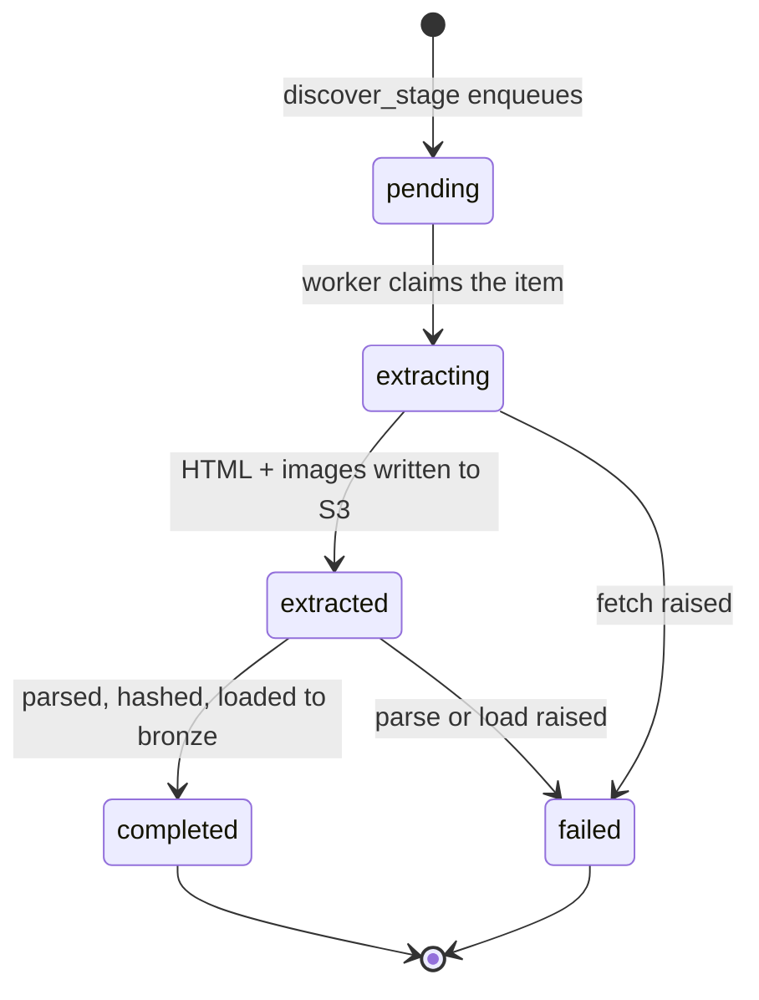
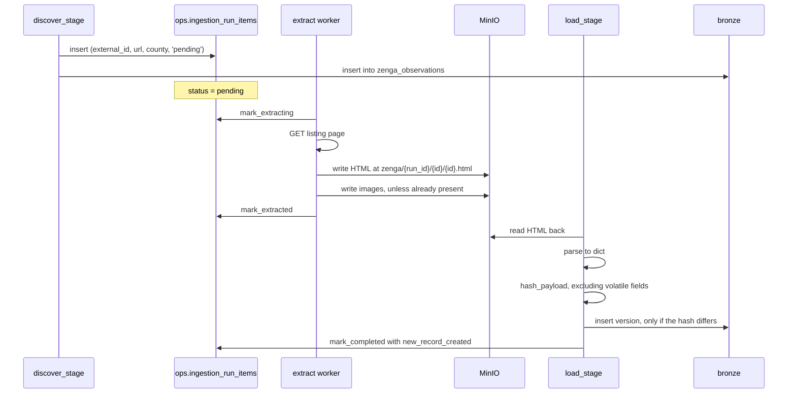

# Ingestion

[← Architecture](01-architecture.md) · [Docs index](README.md) · [Next: Change detection →](03-change-detection.md)

---

This is the listings pipeline: the job that crawls zenga.hu, stores what it finds, and lands it in `bronze`. It is the most operationally demanding part of the system, because it is the only part that depends on a third party's HTML staying parseable and their servers staying up.

The entry point is 12 lines. From [`run.py`](../api/packages/ingest/src/ingatlanmizu/ingest/run.py):

```python
def main():
    source = get_source("zenga")
    run_id = start_run(source=source.name, metadata={"seed_urls": [s.to_dict() for s in source.seed_urls]})
    discover_stage(run_id=run_id)
    extract_stage(run_id=run_id)
    load_stage(run_id=run_id)
    finish_run(run_id=run_id)
```

Three stages, one identifier threading through all of them. Everything below is about why it is shaped that way.

## Stages are driven by database state, not process memory

This is the single most important design decision in the ingestion layer, so it goes first.

Look at what `main()` passes between stages: only `run_id`. Not the source object, not the seed URLs, not the list of discovered listings. Each stage re-reads what it needs from Postgres. From [`stages.py`](../api/packages/ingest/src/ingatlanmizu/ingest/stages.py):

```python
def _source_for(run_id: int) -> tuple[Source, dict]:
    run = fetch_run(run_id=run_id)
    return get_source(run["source"]), run["metadata"]
```

`start_run` snapshots the seed URLs into `ops.ingestion_runs.metadata` as JSONB. `discover_stage` reads them back out and rehydrates them into `SeedUrl` objects — it does not use the in-memory list it could trivially have received as an argument.

That looks like an indirection for nothing. It buys three things:

**Auditability.** Every run carries a permanent record of the exact inputs it used. Six months later, given an anomalous number in a mart, you can ask which seed URLs produced the run behind it and get an answer from the database rather than from a guess about what the code looked like at the time.

**Re-runnability.** Because no stage depends on state held by a previous stage's process, any stage can be re-executed against an existing `run_id` in a fresh process. If `load_stage` crashed halfway, calling it again picks up exactly the items still in `extracted` — no re-crawling, no re-parsing of what already loaded.

**A seam for distribution.** Stages that communicate only through a database can run as separate processes, on separate machines, at separate times. Nothing here does that today, and nothing needs to, but the refactor that would enable it has already been paid for.

The alternative — passing Python objects between function calls — is simpler and shorter, and it makes the whole run one atomic unit that either succeeds or has to start over from the beginning. For a job that makes hundreds of HTTP requests to somebody else's server, "start over from the beginning" is the wrong failure mode.

## The status machine is the queue

`ops.ingestion_run_items` is a work queue implemented as a table. Each discovered listing becomes a row, and its `status` column drives the pipeline.



Stage transitions are just queries against that column:

```python
def extract_stage(run_id: int):
    run_items = dequeue_run_items(run_id=run_id, status="pending")
    ...

def load_stage(run_id: int):
    run_items = dequeue_run_items(run_id=run_id, status="extracted")
    ...
```

No broker, no Redis, no Celery. For a workload of a few hundred items per run, on a single machine, with the durability requirement already satisfied by the Postgres instance that has to exist anyway, a message queue would be a second piece of infrastructure providing capabilities nobody needs.

*What it costs:* `dequeue_run_items` is a plain `SELECT`, not a `SELECT ... FOR UPDATE SKIP LOCKED`, so this queue is safe for one consumer process at a time. Two concurrent `ingest` processes over the same run would both claim the same items. That is fine today — Ofelia runs exactly one — but it is the specific line that would have to change first if this ever needed to scale out, and it is worth knowing that in advance rather than discovering it.

## Per-item failure isolation

The unit of failure is one listing, not one run. From [`runner.py`](../api/packages/ingest/src/ingatlanmizu/ingest/runner.py):

```python
def run_extract_item(source: Source, run_item_id: int):
    try:
        run_item = fetch_run_item(run_item_id=run_item_id)
        mark_extracting(run_item_id=run_item_id)
        source.fetch_listing(...)
        mark_extracted(run_item_id=run_item_id)
    except Exception:
        mark_failed(run_item_id=run_item_id, error_message=traceback.format_exc())
```

A bare `except Exception` is usually a smell. Here it is the point: the failure modes of a web crawl are unbounded and mostly uninteresting individually — a 404 on a listing deleted between discovery and fetch, a connection reset, a page whose markup changed for one property type. A naive script raises on item 3 and loses items 4 through 400. This one records the full traceback against the item, marks it `failed`, and continues.

The tracebacks are queryable, which is what makes this more than swallowing errors:

```sql
select external_id, url, left(error_message, 200)
from ops.ingestion_run_items
where ingestion_run_id = 42 and status = 'failed';
```

A recurring `AttributeError` across many items in one run is how you find out the source site changed its markup — a signal that a crashing script would have delivered as a single stack trace with no indication of how widespread the problem was.

*What it costs:* nothing re-queues `failed` items, so a transient network blip permanently loses that listing for that run. Given the 6-hourly schedule, it will most likely be rediscovered later; that is mitigation, not a fix. See [Limitations](08-limitations.md).

## Concurrency shaped by the bottleneck

The two stages have opposite concurrency treatments, on purpose.

**Extract is parallel.** It is network-bound — hundreds of independent HTTP round-trips, each spending nearly all its wall time waiting on a remote server:

```python
with ThreadPoolExecutor(max_workers=settings.ingest_max_workers) as pool:
    futures = [pool.submit(run_extract_item, source, run_item["id"]) for run_item in run_items]
    for future in as_completed(futures):
        future.result()
```

`ingest_max_workers` defaults to 8 ([`config.py`](../api/packages/core/src/ingatlanmizu/core/config.py)) and is environment-tunable. The bound is politeness toward the source, not local capacity.

**Load is sequential.** It is database-bound, and it is order-sensitive: change detection compares each listing against its own most recent version, so concurrent loads of two versions of the same listing could interleave into the wrong order. Parallelising it would trade a correctness property for a speedup on the stage that is not the bottleneck.

### Thread-local HTTP sessions

`requests.Session` gives connection pooling and keep-alive, which matters a great deal across hundreds of requests to one host. It is also **not thread-safe**. Sharing one across the pool is a well-known way to produce rare, unreproducible failures.

From [`extract.py`](../api/packages/ingest/src/ingatlanmizu/ingest/sources/zenga/extract.py):

```python
_local = threading.local()

def _session() -> requests.Session:
    session = getattr(_local, "session", None)
    if session is None:
        session = requests.Session()
        _local.session = session
    return session
```

One session per worker thread, created lazily on first use. Each thread keeps its own persistent connection to the host; no session is ever touched by two threads. Both properties are needed, and the four-line accessor gets both.

### Why threads and not asyncio

`requests`, `beautifulsoup4`, and `psycopg` are synchronous libraries. Going async would mean replacing all of them and rewriting the parsing and loading code around an event loop. The workload is I/O-bound at a scale of eight concurrent requests — nowhere near the thousands-of-connections regime where the GIL and thread overhead start to dominate. Threads reach the same throughput here with none of the rewrite.

If this needed 500 concurrent fetches, the calculus would flip. It needs 8.

## Raw-first storage

Nothing parses a page before the page has been durably stored.

`fetch_listing` writes the HTML to object storage, *then* returns it for downstream parsing. The principle is worth stating directly, because it is the one that most distinguishes a pipeline from a script:

> Parsers are wrong eventually, and requirements grow eventually. Neither should ever require going back to the source.

If a selector silently starts returning `None` next month, the fix is a re-parse of stored HTML. If a field that was never extracted becomes interesting — energy rating, say, before it was a column — it can be backfilled across the entire history. Both operations are free, local, and repeatable. Without stored raw HTML, both are impossible, because the source site only ever serves the present.

### Key layout

From [`storage.py`](../api/packages/ingest/src/ingatlanmizu/ingest/storage.py):

```python
def _html_file_path_for(source: str, external_id: str, run_id: int) -> str:
    key = f"{source}/{run_id}/{external_id}/{external_id}.html"
    return key

def folder_for_images(source: str, external_id: str) -> str:
    return f"{source}/images/{external_id}"
```

Two different schemes, for two different reasons.

**HTML is run-scoped** — `run_id` is in the path. Every run's snapshot is a separate immutable object, so the raw evidence behind any specific run survives all subsequent runs. That is what makes the lineage chain below actually resolvable.

**Images are not run-scoped**, and are guarded by a short-circuit:

```python
def fetch_listing_images(external_id: str, html: str) -> None:
    if has_images(source="zenga", external_id=external_id):
        return
```

A listing's photographs do not change; its price does. Re-storing an identical gallery on every run, to preserve a history that does not vary, would be storage and bandwidth spent on nothing. One `list_objects_v2` call against the object store skips the entire gallery download for any already-seen listing — which, on a source crawled every 6 hours, is most of them. This is the largest single saving in the crawl, in both bandwidth and politeness.

Image URLs are discovered from the page's JSON-LD `<script type="application/ld+json">` blocks rather than from `` tags — structured data a site publishes for search engines is considerably more stable than its markup. The extraction handles `@graph` wrappers, bare objects, and lists, then filters to `images.zenga.hu` URLs containing the listing's own ID, so gallery images are collected without picking up site chrome or another listing's thumbnails.

## Lineage: `run_id` as a correlation ID

A number in a mart can be traced back to the bytes it came from. The chain:

```
gold.mart_market_monthly_by_county
  └─ int_listings__monthly
       └─ stg_zenga__listing_versions.ingestion_run_id
            └─ ops.ingestion_runs.id
                 ├─ ops.ingestion_runs.metadata      → the seed URLs that run used
                 ├─ ops.ingestion_run_items           → per-listing status and errors
                 └─ s3://…/zenga/{run_id}/{external_id}/{external_id}.html
                                                       → the exact HTML that produced the row
```

`ingestion_run_id` is carried on `bronze.zenga_listing_versions` (migration [012](../api/db/migrations/012_add_ingestion_run_id_to_zenga_listings.sql)) and on `bronze.zenga_observations` (migration [017](../api/db/migrations/017_create_zenga_observations_table.sql)), and survives into the silver models as a passed-through column.

"Where did this number come from?" is the question that gets asked about every data product eventually, and it is usually unanswerable. Here it costs one integer column per table.

## The `Source` abstraction

zenga.hu is one property portal among several in Hungary. The ingestion machinery — run tracking, the status machine, threading, failure isolation, storage — is portal-independent; only six operations are portal-specific. Those six are the interface. From [`base.py`](../api/packages/ingest/src/ingatlanmizu/ingest/sources/base.py):

```python
@dataclass(frozen=True)
class Source:
    name: str
    seed_urls: list[SeedUrl]

    discover:    Callable[[list[SeedUrl]], list[ListingReference]]
    fetch_listing: Callable[[ListingReference, IngestionRunId], ListingContent]
    parse:       Callable[[ListingContent], SourceSpecificListingDict]
    load:        Callable[[SourceSpecificListingDict, IngestionRunId, PayloadHash], NewRecordCreated]

    hash_payload:       Callable[[SourceSpecificListingDict], str]
    record_observation: Callable[[ListingReference, IngestionRunId], None]
```

### Why a dataclass of functions instead of an abstract base class

The obvious alternative is `class ZengaSource(BaseSource)` with six methods. This design deliberately does not do that, for three reasons:

1. **There is no per-source state.** Every operation is a pure function of its arguments — no instance attributes are read or written across calls. A class here would be a namespace wearing an object costume, and `self` would be permanently unused.
2. **The functions stay independently testable.** `parse` is a module-level function taking a `ListingContent` and returning a dict. Testing it needs no object graph, no fixtures, no partially-constructed source: pass a `ListingContent` built from a saved HTML file, assert on the dict. That property survives because there is nothing to construct.
3. **It composes.** A second portal that happens to use the same discovery mechanism can reuse that function directly, rather than needing an inheritance hierarchy or a mixin to share it.

*What it costs:* a static type checker verifies the callable signatures but nothing enforces that a source module *exports* all six names until the `Source(...)` construction runs at import time. An ABC would fail at class definition. In practice both fail at import, so the difference is small.

### The type aliases

```python
SourceSpecificListingDict: TypeAlias = dict[str, str|None]
IngestionRunId: TypeAlias = int
PayloadHash:    TypeAlias = str
NewRecordCreated: TypeAlias = bool
```

Without these, `load`'s signature is `Callable[[dict, int, str], bool]` — four anonymous primitives whose meaning lives only in the author's memory. With them the signature is self-describing, and `NewRecordCreated` in particular explains a bare `bool` return that would otherwise need a comment. Zero runtime cost.

### Adding a portal

1. Create `sources/<portal>/` with `extract.py`, `parse.py`, `load.py`.
2. Implement the six callables.
3. Build the `Source` in `sources/<portal>/__init__.py` with its seed URLs.
4. Register it in [`sources/__init__.py`](../api/packages/ingest/src/ingatlanmizu/ingest/sources/__init__.py):

```python
SOURCES: dict[str, Source] = {s.name: s for s in (ZENGA,)}

def get_source(name: str) -> Source:
    try:
        return SOURCES[name]
    except KeyError:
        raise ValueError(f"unknown source {name}; known: {SOURCES}")
```

5. Add a `stg_<portal>__listing_versions.sql` model that maps its columns onto the shared silver schema, and add it to the `int_*__unioned` models.

No change to `stages.py`, `runner.py`, `tracking.py`, or `storage.py`. The unknown-source error deliberately lists the known keys — a small courtesy to whoever hits it, including future you.

## Discovery and the sampling strategy

`SEED_URLS` in [`sources/zenga/__init__.py`](../api/packages/ingest/src/ingatlanmizu/ingest/sources/zenga/__init__.py) holds **84 entries**: 19 counties × {house, flat} = 38, plus 23 Budapest districts × {house, flat} = 46. Each carries the county it belongs to, so geography is attached at discovery time from a known-correct constant rather than parsed out of a free-text address later — one of the few pieces of metadata this pipeline knows for certain about every listing.

Budapest districts all map to `county = "Budapest"`, matching how Hungarian property statistics are conventionally reported, while the district survives in the address for city-level models.

Each run samples:

```python
SOURCE = Source(name="zenga", seed_urls=_random_urls(2), ...)
```

```python
url = f"{seed_url.url}?page={random.randint(1, 30)}"
```

Two random seed URLs, one random page from the first 30, every 6 hours.

**This is a sample, not a census, and the documentation should say so plainly.** The design intent is a crawler that is light on the source — a few dozen page fetches per run rather than a full sweep of 84 categories × N pages — while accumulating breadth over time: four runs a day across 84 seeds covers the space stochastically rather than hammering it.

What that costs is real and worth being precise about:

- The listing inventory is never complete at any point in time. Counts in the marts are counts of *sampled* listings.
- Pages are ordered by the source's own default sort, which is not random with respect to price, so page number is not an ignorable variable.
- `random.randint` samples **with replacement** — one run can draw the same seed twice, which then also produces duplicate run items for the listings on it.
- Coverage across the 84 seeds is uneven over any finite window; some categories are oversampled and some are missed for days.

The medians in the marts are therefore medians of a convenience sample. That is a defensible thing to build, and an indefensible thing to leave undocumented. [Limitations](08-limitations.md) carries the concrete fix.

One implementation detail worth knowing when reading the code: `_random_urls(2)` is called at **module import time**, in the `SOURCE` constructor. The seeds are therefore fixed for the lifetime of the process, not re-drawn per call. For a one-shot CLI process that is exactly right — the run's seeds are chosen once and snapshotted into `ops.ingestion_runs.metadata`. In a long-lived process it would be a bug, because every run would reuse the seeds chosen at startup.

Discovery itself is deliberately dumb: fetch the listing page, take every `<a>` whose `href` starts with `/ingatlan/`, and use the last path segment as the external ID. There is no attempt to interpret the listing card's summary data, because the detail page is authoritative and will be fetched anyway.

## Parsing

[`parse.py`](../api/packages/ingest/src/ingatlanmizu/ingest/sources/zenga/parse.py) turns one listing's HTML into a flat dict. Three decisions in it are about surviving a source you do not control.

### Anchor on `data-cy`, not on CSS classes

```python
def _by_cy(soup, value):
    """Első elem a megadott data-cy attribútummal."""
    return soup.find(attrs={"data-cy": value})
```

Every selector goes through this. `data-cy` is the conventional attribute for Cypress end-to-end test hooks. Attributes of that kind are load-bearing for the site's *own* test suite, which gives them a stability that presentation markup does not have: changing one breaks the site's CI, changing a CSS class breaks nothing. Class names on a utility-CSS site churn with every visual tweak, and a class-based scraper needs repair on that same cadence.

Picking selectors by *why the site keeps them stable* rather than by what is convenient in the inspector is the difference between a crawler that runs unattended and one that is a standing maintenance task.

### Match by label, not by position

Three headline parameters sit under the gallery, but which three depends on the property type: a flat shows floor, a house shows plot size. Indexing them positionally silently mislabels every house in the dataset.

```python
def _highlight_params(soup):
    found = {}
    for slot in ("first", "second", "third"):
        value = _text(_by_cy(soup, f"advert-details-{slot}-param"))
        label = _text(_by_cy(soup, f"advert-details-{slot}-param-title"))
        if label is None:
            continue
        key = HIGHLIGHT_LABELS.get(label)
        if key is not None and key not in found:
            found[key] = value
    return found
```

The slot is iterated, but the *destination* comes from the label. An unrecognised label lands nowhere rather than in the wrong column — silence being the correct failure mode when the alternative is confidently wrong data.

### Distinguish "no value" from "a button"

Some fields are gated behind an ask-the-seller button rather than being shown. Read naively, energy rating for those listings becomes the string `"Megkérdezem"` ("I'll ask"), which then flows into an enum column and fails a test somewhere far downstream:

```python
if cells[1].find("button") is not None:
    params[label] = None
else:
    params[label] = _text(cells[1])
```

A missing value is recorded as missing. Small, and the kind of thing only found by reading actual pages rather than one happy-path example.

### Everything lands as a string

Note what `parse` does *not* do: no `int()`, no `float()`, no date parsing, no unit stripping. `"49,9 millió Ft"` goes into `bronze` as exactly that. The bronze schema ([`003_create_zenga_listings_table.sql`](../api/db/migrations/003_create_zenga_listings_table.sql)) is `varchar` and `text` throughout.

This is the medallion contract taken seriously. Bronze's job is to be a faithful record of what the source said; the moment ingestion starts coercing types it starts making judgement calls, and a judgement call made at ingest time is baked in permanently — a value that fails `int()` is either lost or crashes the run, and either way the original is gone. Deferring to dbt means the cleaning rules are version-controlled SQL, tested, and re-runnable over the full history when they turn out to be wrong.

Alongside the promoted columns, the whole parsed dict is stored in a `raw_data` JSONB column. Anything the parser captured but no column exists for is still queryable, and promoting it later to a real column is a migration plus a backfill from data already present.

## What happens to a single listing

Following one listing end to end:



Two details in that diagram are the subject of the next document. The observation is written at **discovery** time, before the page is even fetched — presence is a fact established by having seen the listing in a search result. The version is written at **load** time, and only if the content actually changed.

Why those are two separate tables, and what the hash excludes, is [Change detection](03-change-detection.md).

---

[← Architecture](01-architecture.md) · [Docs index](README.md) · [Next: Change detection →](03-change-detection.md)
