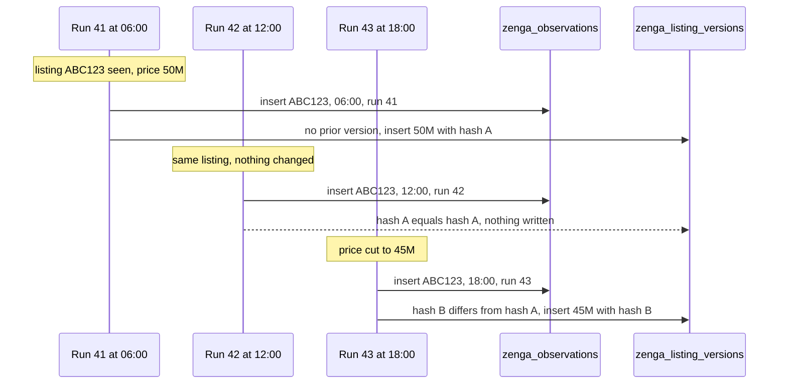

# Change detection and versioning

[← Ingestion](02-ingestion.md) · [Docs index](README.md) · [Next: Market indicators →](04-indicators.md)

---

The pipeline crawls the same listings over and over. Every 6 hours it may see the same property again, usually completely unchanged. Two questions follow, and they have different answers:

1. **Was this listing still on the market at 04:00 today?** — a question about *presence*.
2. **Did anything about it change?** — a question about *content*.

Conflating them is the most common way a scraping pipeline quietly produces wrong history. This document is about how they are kept apart, and how "did anything change" is answered cheaply and correctly.

## How the schema got here

The design is visible in the migration history, which is worth reading in order because it records a real change of mind rather than a plan executed on the first try.

| Migration | Change |
|---|---|
| [003](../api/db/migrations/003_create_zenga_listings_table.sql) | `bronze.zenga_listings` created — one row per listing |
| [004](../api/db/migrations/004_make_ad_key_unique.sql) | `unique(hirdeteskod)` added — one row per listing, *enforced* |
| [005](../api/db/migrations/005_add_timestamps.sql) | `created_at` / `updated_at`, plus a trigger to maintain `updated_at` |
| [010](../api/db/migrations/010_drop_ad_unique_key_from_zenga_listings_table.sql) | **the unique constraint dropped** |
| [011](../api/db/migrations/011_drop_updated_at_trigger_from_zenga_listings_table.sql) | **the `updated_at` trigger dropped** |
| [013](../api/db/migrations/013_add_payload_hash_to_zenga_listings_table.sql) | `payload_hash` added |
| [015](../api/db/migrations/015_add_ad_key_created_at_index_to_zenga_listings.sql) | index on `(hirdeteskod, created_at desc)` |
| [017](../api/db/migrations/017_create_zenga_observations_table.sql) | `bronze.zenga_observations` created |
| [018](../api/db/migrations/018_rename_zenga_listings_table.sql) | table renamed to `zenga_listing_versions` |

Migrations 003–005 describe a **mutable current-state table**: one row per listing, updated in place, with `updated_at` tracking the last touch. That is the obvious first design, and it is what most scrapers do.

It is also lossy in a way that cannot be repaired later. An in-place update overwrites the previous price. A price history assembled from that table has exactly one data point per listing — the present — and no amount of future crawling recovers the past.

Migrations 010, 011, 013, and 018 are the correction: drop the uniqueness, drop the update trigger, add a content hash, and rename the table to say what it now is. `zenga_listing_versions` is **append-only**. Nothing in the codebase issues an `UPDATE` or `DELETE` against it.

That is a hand-rolled Type 2 slowly-changing dimension. dbt snapshots would be the off-the-shelf alternative; they were not used because the change detection has to happen at *ingest* time — it is what decides whether a row is written at all — and a snapshot runs later, over rows already in the warehouse.

## Two tables, two facts

```
bronze.zenga_observations       one row every time a listing is SEEN
bronze.zenga_listing_versions   one row every time a listing CHANGES
```

`zenga_observations` is written during discovery ([`load.py`](../api/packages/ingest/src/ingatlanmizu/ingest/sources/zenga/load.py)) and is deliberately almost empty:

```sql
create table if not exists bronze.zenga_observations (
    id serial primary key,
    listing_code varchar(100) not null,
    observed_at timestamptz default now(),
    ingestion_run_id int references ops.ingestion_runs (id)
)
```

Four columns: what was seen, when, and by which run. No property attributes at all — those belong to the version table, and duplicating them here would create two sources of truth for the same fact.

### Why not one table

Suppose only `zenga_listing_versions` existed. A listing crawled 50 times over three weeks without a single edit produces exactly one row, dated the first sighting. Nothing distinguishes it from a listing seen once and never again.

Every metric about *duration* then becomes impossible:

- **Time on market** needs first-seen and last-seen, which are presence facts.
- **Delisting detection** — the thing that approximates "sold" — is entirely about absence, which is only visible against a record of presence.
- **Sampling coverage**, how often the crawler actually reaches a listing, is only measurable from observations.

And the inverse also holds: a table with a row per sighting *including* full attributes would be enormous and almost entirely redundant, since most sightings change nothing.

Splitting them gives each table the grain that matches its fact. Observations are high-volume and narrow. Versions are low-volume and wide. Downstream, [`int_listings__time_on_market`](../api/transform/models/intermediate/int_listings__time_on_market.sql) reads only observations; [`int_listings__price_changes`](../api/transform/models/intermediate/int_listings__price_changes.sql) reads only versions; and [`int_listings__monthly`](../api/transform/models/intermediate/int_listings__monthly.sql) joins the two — months come from observations, attributes from versions. That model would not be expressible at all without the split.

## The payload hash

A version row is written only when content changed. "Changed" is defined by a SHA-256 over the parsed payload:

```python
def hash_payload(listing: SourceSpecificListingDict) -> str:
    payload = {}
    for key, value in listing.items():
        if key in ["html_path", "images_path", "frissitve", "hirdeto_neve", "ingatlan_iroda_neve"]:
            continue
        payload[key] = value
    js = json.dumps(payload, sort_keys=True, ensure_ascii=False)
    return hashlib.sha256(js.encode("utf-8")).hexdigest()
```

Two things are doing work here.

**Canonicalisation.** `sort_keys=True` makes the hash independent of dict ordering, so a reordering of the parser's field assignments does not invalidate every hash in the database. `ensure_ascii=False` keeps Hungarian characters as themselves rather than `\uXXXX` escapes — either is deterministic, but the choice must never change, because changing it silently invalidates the entire history and causes one enormous fake round of "changes".

**The exclusion list — the real content of this function.** Five fields are excluded, for two distinct reasons:

| Excluded field | Why |
|---|---|
| `html_path` | Contains `run_id` by construction. **Changes on every single run.** |
| `images_path` | Same reason |
| `frissitve` | The site's own "last updated" stamp. Moves without the listing changing |
| `hirdeto_neve` | Advertiser name. Churns as agents change without the property changing |
| `ingatlan_iroda_neve` | Agency name. Same |

`html_path` is the one that makes exclusion mandatory rather than merely useful. It is `zenga/{run_id}/{external_id}/{external_id}.html` — a different string on every run, by design. Hashing it would make *every* payload differ from its predecessor, which means:

- a new version row for every listing on every run, four times a day;
- the version table growing without bound while containing no information;
- and worst, [`int_listings__price_changes`](../api/transform/models/intermediate/int_listings__price_changes.sql) — which reports a change whenever consecutive versions differ in price — being fed a stream of versions that are identical in price, so it stays quiet, while every *other* consumer of "how many versions does this listing have" becomes meaningless.

The principle generalises: **hash the substance, not the envelope.** Fields that describe where the data was stored, or when it was fetched, are metadata about the observation, not attributes of the thing observed.

`frissitve` is the subtler case and the one that shows the exclusion list was derived from real behaviour rather than reasoned about in the abstract. Many listing sites bump a "last updated" timestamp when an agent re-promotes a listing without editing anything. Included in the hash, it manufactures changes that did not happen.

*What it costs:* an excluded field's changes are invisible. If an agency genuinely transfers a listing to a different office, `ingatlan_iroda_neve` changes and no version is written, so that fact is lost unless something else changed too. That is a deliberate trade — those fields are not what this product measures — but it is a trade, and a different product would draw the line differently.

## Reading the last version

```python
def _has_changed(listing: SourceSpecificListingDict, payload_hash: PayloadHash) -> bool:
    row = conn.execute("""
        select payload_hash
        from bronze.zenga_listing_versions
        where hirdeteskod = %s
        order by created_at desc
        limit 1
    """, (listing["hirdeteskod"],)).fetchone()

    if row is None:
        return True
    return False if row[0] == payload_hash else True
```

Comparison is against the *most recent* version only, not against every historical version. That is intentional: a listing whose price goes 50M → 45M → 50M should produce three version rows, because the second return to 50M is a genuine market event. Matching against any historical hash would swallow it.

This query runs once per listing per run — a few hundred times per run, growing linearly with the size of the version table. Hence migration [015](../api/db/migrations/015_add_ad_key_created_at_index_to_zenga_listings.sql):

```sql
create index if not exists idx_zenga_hirdeteskod_created_at
on bronze.zenga_listings (hirdeteskod, created_at desc);
```

The column order matches the query exactly: equality predicate first, sort key second, descending to match the `order by`. Postgres satisfies the whole thing from the index without touching the heap for anything except the single returned row. It is a small index, but it is one justified by a measured access pattern rather than added by reflex — and it is the *only* index added to that table.

## Two runs, one listing



After three sightings: **three observation rows, two version rows.** The observation table knows the listing was live at 06:00, 12:00, and 18:00. The version table knows it was 50M and then became 45M. Neither table could answer the other's question.

The `new_record_created` boolean returned by `load` is recorded back onto the run item (migration [016](../api/db/migrations/016_add_new_record_created_to_ingestion_run_items.sql)), so a run's change rate is queryable directly:

```sql
select count(*) filter (where new_record_created) as changed,
       count(*)                                  as processed
from ops.ingestion_run_items
where ingestion_run_id = 42 and status = 'completed';
```

A sudden jump in that ratio is a useful alarm: either the market moved, or something started leaking into the hash that should not be there.

## Delivery semantics

Insert-into-bronze and mark-item-completed happen on **separate connections**, in separate transactions ([`load.py`](../api/packages/ingest/src/ingatlanmizu/ingest/sources/zenga/load.py), [`tracking.py`](../api/packages/ingest/src/ingatlanmizu/ingest/tracking.py)). A crash in between leaves a version row written and its run item still marked `extracted`.

The pipeline is therefore **at-least-once**, not exactly-once.

The reason that is acceptable — and the order of the argument matters — is that **the payload hash makes `load` idempotent**. On the retry, `_has_changed` compares the recomputed hash against the version just written, finds them identical, and returns without writing. The duplicate that at-least-once delivery threatens to produce cannot actually be produced.

So the same mechanism that keeps the version table small also removes the need for distributed transactions between the ops schema and the bronze schema. Two properties from one hash — which is why the exclusion list is worth as much care as it gets.

*What it costs:* a genuine edge case. If a listing changes *again* between the crash and the retry, the retry hashes the newer content, finds it different, and writes a second version — the correct outcome, arrived at accidentally. And a crash between the two statements leaves the item stuck in `extracted` with nothing to re-drive it, since `load_stage` only runs when the whole job runs. Re-invoking `load_stage` with the same `run_id` clears it; nothing does so automatically. See [Limitations](08-limitations.md).

---

[← Ingestion](02-ingestion.md) · [Docs index](README.md) · [Next: Market indicators →](04-indicators.md)
