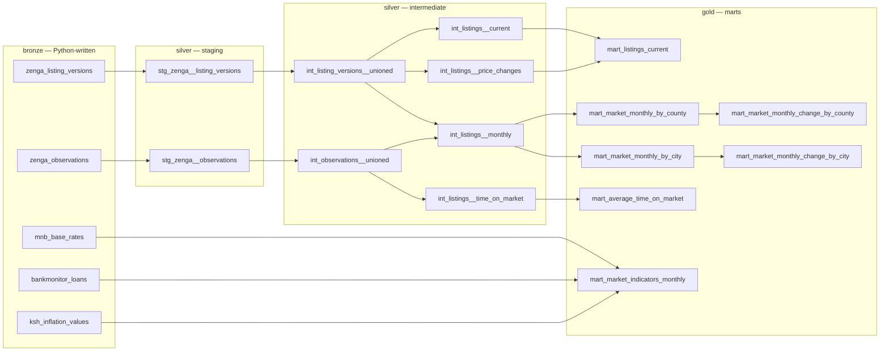

# Transformations

[← Market indicators](04-indicators.md) · [Docs index](README.md) · [Next: Data quality →](06-data-quality.md)

---

Everything up to this point produced faithful, messy, string-typed rows in `bronze`. This layer turns them into numbers a person can read. It is a dbt project living in [`api/transform`](../api/transform/), built with `make dbt-build`.

The chain is `bronze` → staging → intermediate → marts, with staging and intermediate materialized as views in `silver` and marts as tables in `gold` ([why](01-architecture.md#materialization-views-in-silver-tables-in-gold)).



## Staging: the cleaning layer

[`stg_zenga__listing_versions.sql`](../api/transform/models/staging/zenga/stg_zenga__listing_versions.sql) does four jobs at once, and keeps them in separate CTEs so it stays readable:

1. **Filter** obviously-broken and out-of-scope rows (covered in [Data quality](06-data-quality.md), because that is what it is).
2. **Parse** Hungarian-formatted strings into numbers.
3. **Rename** Hungarian column names to English. `hirdeteskod` → `listing_code`, `alapterulet` → `area_sqm`, `megye` → `county`, `ar` → `price_huf`. Bronze speaks the source's language; everything above silver speaks one language.
4. **Derive** a surrogate key and a normalised property type.

Nothing downstream ever touches a Hungarian identifier or an unparsed string. That is the boundary this layer exists to establish.

## Macros: a domain vocabulary

The [`macros/`](../api/transform/macros/) directory is where knowledge of the Hungarian property market is encoded. Every macro exists because a specific real value broke a specific naive assumption.

### `hu_numeric`

```sql
nullif(
    replace(
        regexp_replace(replace({{ col }}, chr(160), ' '), '[^0-9,]', '', 'g'),
        ',', '.'
    ), ''
)::numeric
```

Three problems in one expression. Hungarian uses a **comma** as the decimal separator, so `49,9` is a naive cast failure. Numbers arrive with **units and words** attached — `"65 m²"`, `"49,9 millió Ft"`. And they contain **non-breaking spaces** (`chr(160)`) as digit-group separators, which look identical to spaces and are not.

Strip everything but digits and commas, swap the comma for a dot, then cast. `nullif(..., '')` handles a value that reduces to nothing at all, so a field of pure text becomes `NULL` rather than a cast error that aborts the build.

| Input | Output |
|---|---|
| `"65 m²"` | `65` |
| `"49,9 millió Ft"` | `49.9` |
| `"1 250 000 Ft"` (nbsp-separated) | `1250000` |
| `"érdeklődjön"` | `NULL` |

### `price_magnitude`

```sql
case
    when {{ col }} ilike '%milliárd%'  then 1000000000
    when {{ col }} ilike '%millió%'    then 1000000
    when {{ col }} ilike '%ezer%'      then 1000
    else 1
end
```

`hu_numeric` on `"49,9 millió Ft"` gives `49.9` — the magnitude word is thrown away, and 49.9 forint is not the price. The pair recovers it: `hu_numeric(ar) * price_magnitude(ar)` = 49,900,000.

Splitting the scale factor into its own macro is what makes this readable at the call site:

```sql
({{ hu_numeric('ar') }} * {{ price_magnitude('ar') }})::bigint as price_huf
```

`::bigint` rather than `int` is deliberate — Hungarian property prices in forint routinely exceed the 2.1 billion `int` ceiling.

### `floor`

```sql
case
    when {{ col }} ilike '%földszint%' then 0
    else                                    {{ hu_numeric(col) }}
end
```

`"földszint"` is ground floor. It contains no digits, so `hu_numeric` returns `NULL` — and a null floor is indistinguishable from a missing floor, which quietly discards every ground-floor flat from any floor-based analysis. Ground floor is a real, common, and specifically meaningful value: it maps to `0`.

### `year_of_building`

```sql
case
    when {{ col }}::int < 1800 then null
    when {{ col }}::int > 2100 then null
    else                       {{ hu_numeric(col) }}
end
```

Free-text entry produces `"19"` for `"1997"` and the occasional far-future typo. Rather than letting a 19 into a median that then reports a median construction year of 19 AD, out-of-range values become `NULL` — the honest representation of "this field was entered wrong."

### `number_of_rooms`

```sql
coalesce(substring({{ col }} from '(^\d+)')::numeric, 0)
    + (coalesce(substring({{ col }} from '\+\s*(\d+)')::numeric, 0) * 0.5)
```

Hungarian listings express room counts as `"3 + 2"`: three full rooms plus two *half* rooms — a half room being a real category in Hungarian property description, under 12 m². The half rooms count as 0.5 each, so `"3 + 2"` is 4.0 rooms, not 5 and not 3.

Cross-market domain knowledge like this is where a scraper becomes a data product. Nothing in the HTML says the second number is halved.

### `city_name` and `location_detail`

```sql
case
    -- Budapest XIII. kerület, Angyalföld -> XIII. kerület
    when {{ col }} ilike '%Budapest%' then
        btrim(split_part(regexp_replace({{ col }}, 'Budapest ', ''), ',', 1))
    -- Szombathely, Olad -> Szombathely
    else
        btrim(split_part({{ col }}, ',', 1))
end
```

One address column, two grammars. Budapest addresses are `Budapest <district>, <neighbourhood>`; everywhere else is `<city>, <district>`. Applying either rule uniformly produces "Budapest" as a single city containing two million people and no district detail, or district names treated as independent cities.

The split keeps the district as the city for Budapest — which is the right grain, since XIII. kerület and XII. kerület are different markets — while `county` stays `"Budapest"` for county-level rollups.

### `listing_key`

```sql
concat('{{ source_name }}', ':', {{ col }})
```

`zenga:8689235`. A source-prefixed surrogate key, and the smallest macro with the largest consequence: two portals can use the same numeric listing ID for different properties, and without the prefix a union would silently merge them. Prefixing at the staging boundary makes every downstream key globally unique by construction.

### `generate_schema_name`

```sql

    
        {{ target.schema }}
    
        {{ custom_schema_name | trim }}
    

```

dbt's default behaviour concatenates: `+schema: silver` under a target schema of `silver` produces `silver_silver`. That default exists to keep developers from colliding in a shared warehouse, which is not the situation here. The override makes `+schema: gold` mean the schema named `gold` — necessary because `gold` is a fixed contract the API queries by name.

## Intermediate: the modeling layer

### The union seam

```sql
-- int_observations__unioned.sql
select * from {{ ref('stg_zenga__observations') }}
```

A one-line model wrapping a single source looks like something to delete. It is the opposite: it is the **extension point**, and it is why adding a second portal does not touch anything downstream.

Everything above these models — six intermediate models and seven marts — reads from `int_*__unioned`, never from `stg_zenga__*`. Adding ingatlan.com means writing `stg_ingatlancom__listing_versions` and adding one `union all` here. Nothing else changes, and because `listing_key` is already source-prefixed, nothing collides.

Honest note: this seam is **unexercised**. It is designed for a second source and has never carried one, and untested extension points have a habit of not quite working when first used. What can be said with confidence is that the alternative — models reading `stg_zenga__*` directly — would guarantee a wide refactor. `int_listing_versions__unioned` also carries the derivations that must be identical across sources:

```sql
case
    when condition = 'Felújítandó'   then 1   -- needs renovation
    when condition = 'Átlagos'       then 2   -- average
    when condition = 'Jó állapotú'   then 3   -- good
    when condition = 'Újszerű'       then 4   -- like new
    when condition = 'Felújított'    then 4   -- renovated
    when condition = 'Új építésű'    then 5   -- new build
    ...
    when condition = 'Ismeretlen'    then 3   -- unknown
end as condition_score
```

(The English glosses in that snippet are editorial; the source has the Hungarian labels only.)

An ordinal 1–5 score from a categorical label, so condition can be averaged and compared. Two judgement calls are embedded and both should be visible: *renovated* and *like new* are scored equal, and **unknown is scored 3, the midpoint** — an imputation, chosen so that missing condition data does not systematically drag a city's median down. A defensible default, and one a reader deserves to know about before interpreting `median_condition_score`.

Putting it here rather than in staging means every source gets the same mapping. A per-source scale would make cross-source comparison meaningless.

### `int_listings__current`

```sql
row_number() over (
    partition by listing_key
    order by observed_at desc, bronze_id desc
) as version_rank
...
where version_rank = 1
```

The canonical "latest row per entity" pattern. `bronze_id desc` is the part worth noticing: two versions can share an `observed_at` at timestamp resolution, and without a tiebreaker the query is non-deterministic — same data, different answer on different runs, which is exactly the kind of bug that survives for months. A monotonic surrogate ID makes it total.

### `int_listings__monthly` — the point-in-time join

This is the strongest piece of modeling in the project, and the one most worth understanding.

```sql
with listing_months as (
    select distinct
        listing_key,
        date_trunc('month', observed_at)::date as month_start
    from {{ ref('int_observations__unioned') }}
)

select distinct on (listing_months.listing_key, listing_months.month_start)
    listing_months.month_start,
    listing_months.listing_key,
    versions.price_huf,
    ...
from listing_months
join {{ ref('int_listing_versions__unioned') }} as versions
    on versions.listing_key = listing_months.listing_key
    and versions.observed_at < listing_months.month_start + interval '1 month'
order by
    listing_months.listing_key,
    listing_months.month_start,
    versions.observed_at desc,
    versions.bronze_id desc
```

Read it in two halves.

**`listing_months`** comes from *observations*: the months in which each listing was actually seen. A listing is present in a month because the crawler saw it that month, not because it exists today. Listings that vanished in April do not appear in May.

**The join** attaches, for each of those months, the version that was current **as of the end of that month** — every version older than the month boundary, ordered newest-first, with `distinct on` taking the first.

That constraint, `versions.observed_at < month_start + interval '1 month'`, is what prevents **look-ahead bias**.

Concretely. A listing appears in March at 50,000,000 HUF, and in May the seller cuts it to 45,000,000:

| Month | This model reports | A naive join to current price would report |
|---|---|---|
| March | 50,000,000 | 45,000,000 |
| April | 50,000,000 | 45,000,000 |
| May | 45,000,000 | 45,000,000 |

The right-hand column is wrong in a specific and dangerous way: it back-projects information that did not exist in March into March. Every historical month would silently change on every ingest, "March median price" would be a different number each time it was queried, and month-over-month change — the entire point of [`mart_market_monthly_change_by_county`](../api/transform/models/marts/mart_market_monthly_change_by_county.sql) — would be measuring the pipeline's own rewriting rather than the market.

The left-hand column is stable. Once March closes, March's numbers never move again.

This is the same discipline as a point-in-time feature store in ML, or as-of joins in financial time series, and it is the difference between a historical record and a dashboard that quietly rewrites the past. It costs one inequality in a join condition.

*Edge case worth knowing:* the observation is written at discovery and the version at load, seconds later. A listing first discovered in the final seconds of a month can have its version row land in the next month, in which case that `(listing, month)` pair finds no qualifying version and drops out. Rare, bounded, and unhandled.

### `int_listings__price_changes`

```sql
lag(price_huf) over (partition by listing_key order by observed_at, bronze_id) as previous_price_huf
...
where previous_price_huf is not null
and price_huf is distinct from previous_price_huf
```

`is distinct from` rather than `!=`. In SQL, `NULL != NULL` is `NULL`, not `true` — so a plain inequality drops rows where either side is null and would silently miss a price appearing or disappearing. `is distinct from` is the null-safe comparison and treats `NULL` as a value.

The same `observed_at, bronze_id` ordering as `int_listings__current` keeps the sequence deterministic.

### `int_listings__time_on_market`

```sql
select
    times_seen.listing_key,
    times_seen.first_seen_at,
    times_seen.last_seen_at,
    times_seen.times_observed,
    (times_seen.last_seen_at - times_seen.first_seen_at) + 1 as days_on_market,
    times_seen.last_seen_at >= source_observations.source_last_observed_at
        - {{ var('time_on_market_active_tolerance_days') }} as is_active
from times_seen
join source_observations on times_seen.source = source_observations.source
```

Built entirely from observations, since presence is the question.

`is_active` compares a listing's `last_seen_at` against **the source's own most recent observation**, not against `current_date`. That matters: if the crawler has been down for a week, comparing to today would mark every listing in the dataset inactive. Comparing to the source's last successful observation means the metric degrades gracefully instead of collapsing.

The tolerance — `time_on_market_active_tolerance_days: 3`, from [`dbt_project.yml`](../api/transform/dbt_project.yml) — exists because this crawler *samples*. Absence from one run is not evidence of delisting; it is more likely evidence that the run happened to draw two other counties. Three days is roughly twelve runs of grace.

**This mitigation is not sufficient, and the metric built on it should be read with caution.** Under random sampling most listings are seen once and then not again for reasons entirely internal to the crawler. [`mart_average_time_on_market`](../api/transform/models/marts/mart_average_time_on_market.sql) labels its count `sold_listings`, and a disappearance can equally mean sold, expired, withdrawn, or simply not sampled — with the last being by far the most common here. Fully spelled out in [Limitations](08-limitations.md).

## Marts

### County and city monthly aggregates

[`mart_market_monthly_by_county`](../api/transform/models/marts/mart_market_monthly_by_county.sql) and its city-level twin are the core output. Both aggregate `int_listings__monthly` and publish, per month × county (× city) × property type:

- `listing_count`, plus a new-build / old-build / unknown breakdown
- `median_price_per_sqm`, with `p25` and `p75` for spread
- `median_year_of_building`, `median_condition_score`
- `new_build_ratio`

**Median everywhere, never mean.**

```sql
percentile_cont(0.5) within group (
    order by listings.price_huf::numeric / nullif(listings.area_sqm, 0)
)::int as median_price_per_sqm
```

Property prices are right-skewed, and this is a *scraped* sample with typos in it. One listing where someone typed an extra zero moves a mean materially and moves a median not at all. Publishing p25 and p75 alongside gives the distribution's shape without exposing it to the same fragility — and `nullif(area_sqm, 0)` guards the division, since a zero area would otherwise raise and fail the whole build.

**Careful null handling in the ratio:**

```sql
case
    when count(*) filter (where listings.is_new_build) = 0     then null
    when count(*) filter (where not listings.is_new_build) = 0 then null
    else round((count(*) filter (where listings.is_new_build)::numeric
        / nullif(count(*) filter (where listings.is_new_build)
               + count(*) filter (where not listings.is_new_build), 0)) * 100, 2)
end as new_build_ratio
```

A ratio computed from a group containing only new builds, or only old ones, is not a meaningful 100% or 0% — it is a group too homogeneous to have a ratio, usually because it has three listings in it. Both degenerate cases return `NULL` rather than a confident-looking extreme. `is_new_build` is itself three-valued (`true` / `false` / `NULL` for unknown condition), so unknowns are excluded from both numerator and denominator instead of being silently counted as old.

That is three separate guards against publishing a number that looks precise and means nothing — and it is the difference between a mart and a `group by`.

### Month-over-month change

```sql
with previous as (
    select month_start, county, main_type,
        lag(median_price_per_sqm) over (
            partition by county, main_type order by month_start
        ) as median_price_per_sqm
    from {{ ref('mart_market_monthly_by_county') }}
)
select ..., round(((current.median_price_per_sqm - previous.median_price_per_sqm)::numeric
                   / previous.median_price_per_sqm) * 100, 2) as change_pct
```

A mart built on a mart, which is legitimate here: the change is a strict function of the published medians, and deriving it from `int_listings__monthly` again would risk the two disagreeing. Partitioning by `(county, main_type)` keeps houses and flats on separate series — a county whose sampled mix shifts from flats to houses would otherwise show a price "change" that is entirely composition.

Note that `lag` over `month_start` treats consecutive *rows* as consecutive months. A county-and-type combination with no sampled listings in some month has no row for it, so the comparison silently spans the gap and compares across two months rather than one. With full-coverage crawling this is a non-issue; with sampling it is a real caveat.

### Market indicators

[`mart_market_indicators_monthly`](../api/transform/models/marts/mart_market_indicators_monthly.sql) joins mortgage offers to inflation:

```sql
join {{ source('bronze', 'ksh_inflation_values') }} as inflation
    on inflation.month_start = date_trunc('month', loans.available_at)::date - interval '1 month'
```

**The one-month lag is deliberate.** KSH publishes a month's CPI partway through the following month. Loan offers collected in June cannot be contextualised by June's inflation print, because in June it does not exist yet. Joining M's offers to M−1's inflation pairs each month's offers with the most recent figure that was actually available at the time — the same point-in-time discipline as `int_listings__monthly`, applied to a publication calendar.

*Naming caveat:* the resulting column is called `inflation` with nothing marking the lag, so a reader has to know. `inflation_prev_month` would carry its own meaning.

**A known defect in the same model.** The base rate is selected like this:

```sql
(
    select base_rate
    from {{ source('bronze', 'mnb_base_rates') }}
    order by valid_until desc
    limit 1
) as base_rate,
```

That subquery is **uncorrelated** — it does not reference the outer row, so it returns the single latest base rate and attaches it to every month in the table. A row for a month a year ago reports today's base rate.

The fix is a correlated join onto the validity interval that [`mnb/parse.py`](../api/packages/indicators/src/ingatlanmizu/indicators/sources/mnb/parse.py) already derives — which is precisely what those `valid_from` / `valid_until` columns were built for:

```sql
join {{ source('bronze', 'mnb_base_rates') }} as rates
    on date_trunc('month', loans.available_at)::date between rates.valid_from and rates.valid_until
```

It is documented rather than quietly fixed because it appears in [Limitations](08-limitations.md) as item 3, and because a documentation set that only describes the parts that work is not worth much.

### `mart_listings_current`

One row per listing, current state, left-joined to its own price history: `price_changes_count`, `original_price_huf`, `price_delta_huf`, and `price_change_pct`.

Every enrichment is wrapped in `coalesce`, which is the right instinct — a listing that never changed price reports `0` changes and a delta of `0`, so "no changes" and "no matching row" do not look the same to a consumer.

**One defect here, found while writing this document.** `original_price_huf` is intended to be the earliest price ever advertised, and the CTE is named `oldest_prices`. The implementation does not produce that:

```sql
oldest_prices as (
    select listing_key, previous_price_huf as oldest_price
    from (
        select *,
            row_number() over (partition by listing_key order by observed_at desc) as rn
        from {{ ref('int_listings__price_changes') }}
    )
    where rn = 1
)
```

`order by observed_at desc` with `rn = 1` selects the **most recent** price change, and takes the price from immediately before it. For a listing that went 50M → 48M → 45M, `original_price_huf` comes out as 48M, not 50M — so `price_delta_huf` and `price_change_pct` describe only the latest step, while their names promise the cumulative move from the original asking price.

The fix is `order by observed_at asc` (with `bronze_id asc` as the tiebreaker, matching the ordering used elsewhere). Recorded in [Limitations](08-limitations.md).

---

[← Market indicators](04-indicators.md) · [Docs index](README.md) · [Next: Data quality →](06-data-quality.md)
